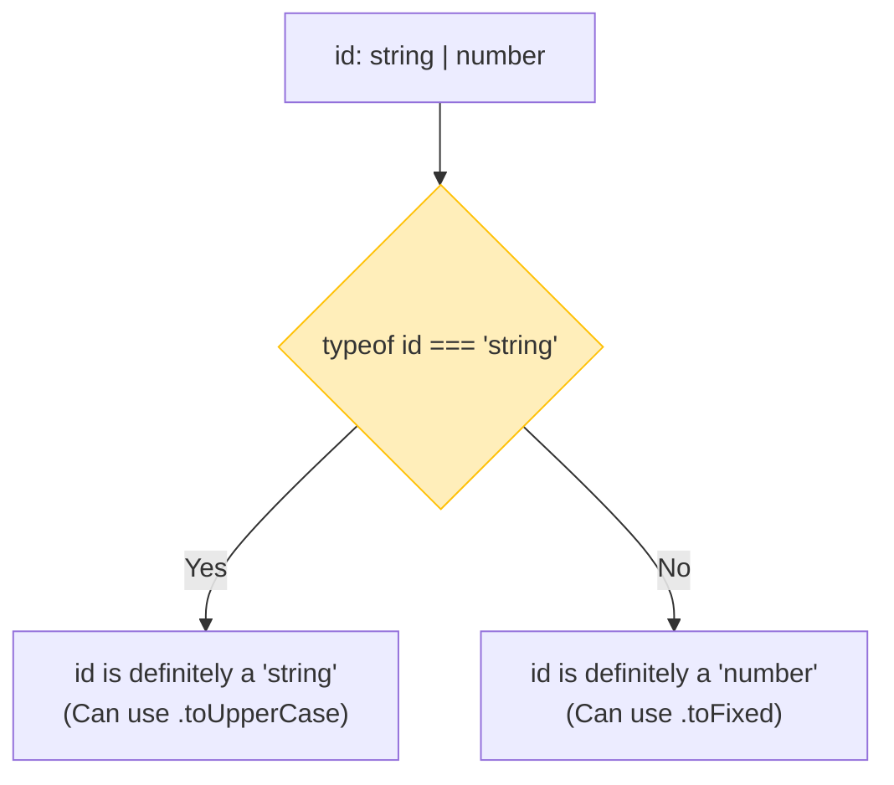

## 🔍 អ្វីទៅជា Type Narrowing?

នៅពេលអ្នកប្រើប្រាស់ Union Type (`string | number`) កូដរបស់អ្នកអាចនឹងមានបញ្ហា ប្រសិនបើអ្នកព្យាយាមហៅមុខងារដែលមិនមាននៅលើប្រភេទទាំងពីរ។



```ts
function printId(id: string | number) {
  // ❌ Error: មិនអាចប្រើ toUpperCase បានទេ ព្រោះ id អាចជាលេខ!
  // console.log(id.toUpperCase());
}
```

ដើម្បីដោះស្រាយបញ្ហានេះ អ្នកត្រូវ "បង្រួម" (Narrow) ប្រភេទរបស់វាសិន តាមរយៈការឆែកលក្ខខណ្ឌ៖

### 1. ការប្រើប្រាស់ `typeof`
នេះគឺជាវិធីសាមញ្ញបំផុតសម្រាប់ឆែកប្រភេទ Primitive (`string`, `number`, `boolean`)។

```ts
function printId(id: string | number) {
  if (typeof id === "string") {
    // នៅក្នុង block នេះ TypeScript ដឹងច្បាស់ថា id ជាអក្សរ!
    console.log("ID របស់អ្នកគឺ៖ " + id.toUpperCase());
  } else {
    // បើមិនមែនជាអក្សរ នោះវាតែងតែជាលេខ!
    console.log("លេខ ID គឺ៖", id.toFixed(2));
  }
}
```
នៅពេលដែល TypeScript ដើរតាមលក្ខខណ្ឌ `if/else` របស់អ្នកដើម្បីវិភាគកូដ យើងហៅវាថា **Control-flow analysis**។

### 2. Truthiness Narrowing
ជារឿយៗអ្នកប្រហែលជាមានអថេរដែលអាចជា `null` ឬ `undefined`។ អ្នកអាចឆែកវាដោយគ្រាន់តែប្រើ `if (value)` ព្រោះ `null` និង `undefined` គឺជា Falsy values។

```ts
function printUsers(users: string[] | null) {
  // បើ users មានតម្លៃ (មិនមែន null ឫ undefined)
  if (users) {
    for (const u of users) {
      console.log(u);
    }
  } else {
    console.log("មិនមានអ្នកប្រើប្រាស់ទេ");
  }
}
```

### 3. ការប្រើប្រាស់ `in` Operator
ប្រសិនបើអ្នកមាន Object ជាច្រើនប្រភេទដែលច្របាច់បញ្ចូលគ្នា (Union) អ្នកអាចឆែកមើលថា តើ Object នោះមាន Property ណាមួយឫអត់ ដោយប្រើពាក្យ `in`។

```ts
type Bird = { fly: () => void };
type Fish = { swim: () => void };

function move(animal: Bird | Fish) {
  if ("fly" in animal) {
    // animal គឺប្រាកដជា Bird
    animal.fly();
  } else {
    // animal គឺប្រាកដជា Fish
    animal.swim();
  }
}
```
