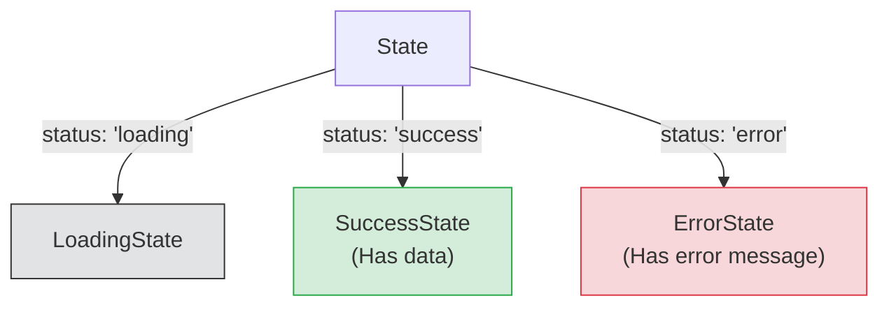

## 🚦 អ្វីទៅជា Discriminated Unions?

នៅក្នុងការបង្កើតកម្មវិធី ជារឿយៗយើងតែងតែមាន Object ដែលអាចផ្លាស់ប្តូររូបរាងទៅតាមស្ថានភាព (State) របស់វា។ 
ឧទាហរណ៍ដ៏ល្អបំផុតគឺ "ស្ថានភាពនៃការទាញយកទិន្នន័យ (Fetching Data)" ដែលវាអាចមាន ៣ ដំណាក់កាល៖
1. កំពុងទាញយក (Loading)
2. ជោគជ័យ និងមានទិន្នន័យមកជាមួយ (Success)
3. បរាជ័យ និងមានសារកំហុសមកជាមួយ (Error)

ប្រសិនបើអ្នកបង្កើតវាជារូបរាង Object តែមួយ វាអាចនឹងមានបញ្ហា៖

```ts
// ❌ របៀបដែលមិនល្អ (ងាយមានកំហុស)
type State = {
  status: string;
  data?: string[]; // ពេល Error វាមិនមាន data ទេ
  error?: string;  // ពេល Success វាមិនមាន error ទេ
};
```

**បញ្ហា:** អ្នកអាចបង្កើត State មួយដែលមានទាំង `data` និង `error` ក្នុងពេលតែមួយ ដែលវាមិនសមហេតុផលសោះ!

### ដំណោះស្រាយ: Discriminated Unions (សហភាពដែលមានការបែងចែកច្បាស់លាស់)

យើងអាចបង្កើត Object ៣ ផ្សេងគ្នា រួចប្រើប្រាស់ Literal Type (`status`) ដើម្បីបែងចែកពួកវា!



```ts
// ✅ របៀបដ៏អស្ចារ្យ (Discriminated Union)
type NetworkState =
  | { status: "loading" }
  | { status: "success"; data: string[] }
  | { status: "error"; message: string };
```

ឥឡូវនេះ បើ `status` ស្មើ `loading` នោះវាប្រាកដជាគ្មាន `data` ទេ!

### របៀបប្រើប្រាស់ជាមួយ `switch` ឫ `if`

ភាពវៃឆ្លាតរបស់ TypeScript នឹងលេចចេញមកនៅពេលអ្នកឆែកតម្លៃ `status`៖

```ts
function renderUI(state: NetworkState) {
  switch (state.status) {
    case "loading":
      console.log("កំពុងទាញយក...");
      // state.data // ❌ Error! TypeScript ដឹងថា Loading អត់មាន data ទេ
      break;
    
    case "success":
      // ត្រង់នេះ TypeScript ដឹងថា state ជា SuccessState
      console.log("ទិន្នន័យ៖ ", state.data); // ✅ អាចហៅបាន
      break;
    
    case "error":
      console.log("មានបញ្ហា៖ ", state.message); // ✅ អាចហៅបាន
      break;
  }
}
```

> 💡 **ចំណាំសម្រាប់ React Developers:** Pattern នេះគឺពេញនិយមបំផុតសម្រាប់ការសរសេរ **Redux Reducers** ឬ **`useReducer` hook** ដោយប្រើប្រាស់ `type` ជា Discriminator (ឧទាហរណ៍ `type: "ADD_USER"` និង `type: "DELETE_USER"`) ដើម្បីបែងចែកសកម្មភាពនីមួយៗអោយមានសុវត្ថិភាពខ្ពស់។
