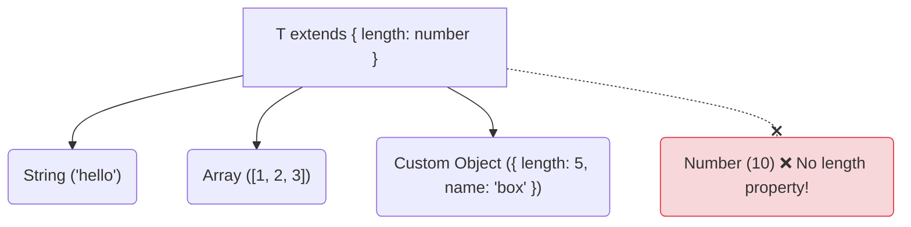

## 🔒 បញ្ហានៃ Generics ដែលបើកទូលាយពេក

នៅក្នុងមេរៀនមុន អក្សរ `<T>` តំណាងអោយ "ប្រភេទអ្វីក៏បាន"។ នេះគឺជាភាពបត់បែន ប៉ុន្តែពេលខ្លះវាក៏ជាបញ្ហាផងដែរ!

ឧបមាថាអ្នកចង់បង្កើត Function មួយដើម្បីបោះពុម្ពទំហំ (ប្រវែង) នៃទិន្នន័យ៖

```ts
// ❌ Error! 
function logLength<T>(item: T): T {
  // TypeScript មិនអោយអ្នកហៅ item.length ទេ 
  // ព្រោះ T អាចជា "លេខ" (Number អត់មាន length ទេ!)
  console.log(item.length); 
  return item;
}
```

## ⛓️ ការដាក់កម្រិត (Generic Constraints)

ដើម្បីដោះស្រាយបញ្ហានេះ យើងត្រូវប្រាប់ TypeScript ថា៖ *"T អាចជាប្រភេទអ្វីក៏បាន តែ **យ៉ាងហោចណាស់** វាត្រូវតែមាន Property `length` ជាលេខ!"*

យើងធ្វើបែបនេះបានដោយការប្រើពាក្យគន្លឹះ **`extends`**។



```ts
// យើងបង្កើត Interface តំណាងអោយលក្ខខណ្ឌរបស់យើង
interface HasLength {
  length: number;
}

// យើងដាក់កម្រិត T អោយមានរូបរាងដូច HasLength យ៉ាងហោចណាស់
function logLength<T extends HasLength>(item: T): T {
  // ឥឡូវនេះ TypeScript ដឹងច្បាស់ថា item ប្រាកដជាមាន length!
  console.log(item.length); 
  return item;
}
```

ឥឡូវនេះយើងអាចសាកល្បងហៅវា៖

```ts
logLength("Hello"); // ✅ ត្រូវ ព្រោះ String មាន length
logLength([1, 2, 3]); // ✅ ត្រូវ ព្រោះ Array មាន length
logLength({ length: 10, value: 3 }); // ✅ ត្រូវ

// logLength(10); // ❌ Error! លេខ 10 មិនមាន length ទេ
```

### ឧទាហរណ៍ជាក់ស្តែងក្នុង React (បញ្ហាញឹកញាប់)

ពេលសរសេរកូដ React/Next.js អ្នកតែងតែមាន Function ដែលទាមទារ Object អោយមាន `id` ជានិច្ច ដើម្បីយកទៅធ្វើការ ដូចជាការលុប ឬកែប្រែទិន្នន័យជាដើម។

```ts
// Function នេះអាចទទួលយក User, Product, ឫ អ្វីក៏ដោយអោយតែមាន id
function extractId<T extends { id: string }>(item: T) {
  return item.id.toUpperCase();
}
```

ការដាក់កម្រិត (Constraint) គឺជាកូនសោរដ៏សំខាន់ដែលអ្នកនឹងជួបប្រទះស្ទើរតែគ្រប់បណ្ណាល័យ (Libraries) របស់ TypeScript!
