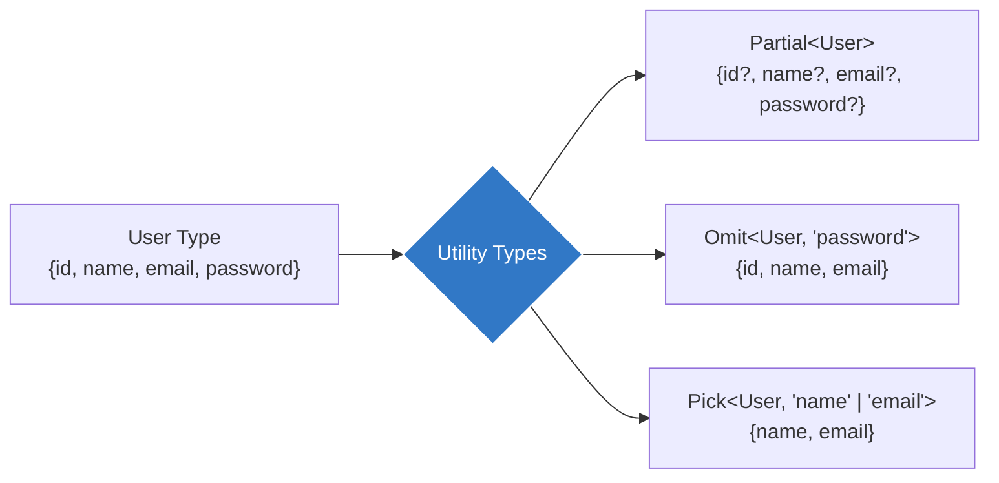

## 🛠️ អ្វីទៅជា Utility Types?

ជារឿយៗអ្នកតែងតែមាន Interface ឫ Type មួយហើយ ប៉ុន្តែនៅក្នុងកាលៈទេសៈផ្សេង អ្នកត្រូវការរូបរាងមួយទៀតដែលស្រដៀងនឹងវាដែរ (ឧទាហរណ៍៖ មាន Property តិចជាង ឫ Optional ទាំងអស់)។
ការសរសេរ Type ឡើងវិញគឺខាតពេល! ដូច្នេះ TypeScript បានផ្តល់នូវ **ឧបករណ៍កែច្នៃ (Utility Types)** ស្រាប់ៗជាច្រើនអោយយើងប្រើ។



### 1. `Partial<T>` (ធ្វើអោយអ្វីៗក្លាយជា Optional)
វាបម្លែង Properties ទាំងអស់នៃប្រភេទ `<T>` អោយទៅជា Optional (`?`)។ វាមានប្រយោជន៍ខ្លាំងណាស់សម្រាប់ការធ្វើ Update (កែប្រែទិន្នន័យខ្លះៗ)។

```ts
interface User {
  id: number;
  name: string;
  email: string;
}

// UpdateUser មានរូបរាងដូចជា: { id?: number; name?: string; email?: string; }
type UpdateUser = Partial<User>;

// យើងអាចបញ្ចូលតែឈ្មោះក៏បាន (មិនបាច់មាន id និង email)
const changes: UpdateUser = { name: "Ratha New" }; 
```
*(ចំណាំ៖ ផ្ទុយពីនេះ គឺ `Required<T>` ដែលធ្វើអោយអ្វីៗដែលជា Optional ក្លាយជាកំហិត (Required) ទាំងអស់វិញ)*។

### 2. `Omit<T, Keys>` (ដកចេញ)
វាបង្កើត Type ថ្មីដោយយក Property ទាំងអស់របស់ `<T>` មក **ដកចេញ** នូវ Keys ណាដែលអ្នកមិនចង់បាន។

```ts
// ឧទាហរណ៍ ពេលអ្នកទាញទិន្នន័យពី Database អ្នកមិនចង់បង្ហាញ password ទេ!
type PublicUser = Omit<User, "password" | "token">;
```

### 3. `Pick<T, Keys>` (ជ្រើសយក)
វាផ្ទុយពី `Omit`! វាយកតែ Property ណាដែលអ្នកបញ្ជាក់ប៉ុណ្ណោះ។

```ts
// យើងចង់បានតែឈ្មោះ និងអុីមែលប៉ុណ្ណោះ
type UserContactInfo = Pick<User, "name" | "email">;
```

### 4. `Record<Keys, Type>` (បង្កើត Object Dictionary)
វាមានប្រយោជន៍ខ្លាំងណាស់សម្រាប់ការបង្កើត Object ដែលអ្នកដឹងពីប្រភេទរបស់ Key និង Value ច្បាស់លាស់។

```ts
// បង្កើត Object ដែល Key ជាឈ្មោះ (string) និង Value ជាអាយុ (number)
const ages: Record<string, number> = {
  ratha: 25,
  dara: 30,
  // "sok": "២០" // ❌ Error! Value ត្រូវតែជាលេខ
};
```

> 💡 **សេចក្តីសន្និដ្ឋាន:** Utility Types ទាំងនេះត្រូវបានប្រើប្រាស់យ៉ាងទូលំទូលាយនៅក្នុងកូដ Production។ ការយល់ដឹងពីពួកវា ជួយសន្សំសំចៃពេលសរសេរកូដបានយ៉ាងច្រើន និងធ្វើអោយកូដមានភាពម៉ត់ចត់ (DRY)។ នៅក្នុង Module 3 យើងនឹងរៀនពីរបៀបដែលគេបង្កើត Utility Types ទាំងនេះឡើងមក!
