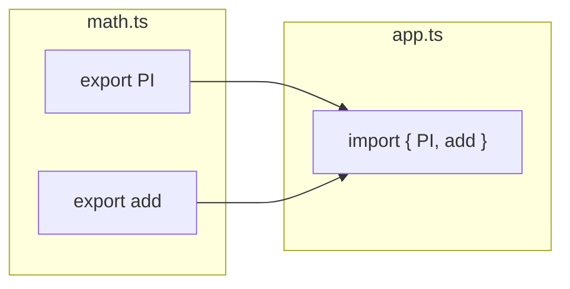

## 📦 អ្វីទៅជា Modules?



នៅពេលគម្រោងរបស់អ្នកធំឡើង អ្នកមិនអាចសរសេរកូដរាប់ពាន់ជួរនៅក្នុងឯកសារតែមួយបានទេ។ យើងត្រូវបំបែកវាជាឯកសារតូចៗ! ឯកសារនីមួយៗហៅថា **Module**។ 

ដើម្បីអាចអោយឯកសារទីមួយ ទាញយកកូដពីឯកសារទីពីរមកប្រើបាន យើងត្រូវពឹងផ្អែកលើការ **នាំចេញ (Export)** និង **ទាញចូល (Import)**។

---

## 1. Named Exports (នាំចេញដោយបញ្ជាក់ឈ្មោះ)

វិធីនេះអនុញ្ញាតអោយអ្នកអាច Export របស់ជាច្រើនចេញពីឯកសារតែមួយបាន។ នៅពេលអ្នក Import វាយកមកប្រើ អ្នកត្រូវតែប្រើសញ្ញា `{}` ហើយ **ឈ្មោះត្រូវតែដូចគ្នា** ទៅនឹងឈ្មោះដែលអ្នកបាន Export ជានិច្ច!

**ឯកសារ `math.ts`:**
```ts
// បន្ថែមពាក្យ export នៅពីមុខ ដើម្បីអនុញ្ញាតអោយគេទាញយកទៅប្រើ
export const PI = 3.14;

export function add(a: number, b: number) {
  return a + b;
}
```

**ឯកសារ `app.ts`:**
```ts
// ប្រើសញ្ញា {} ដើម្បីទាញយករបស់ដែលត្រូវការ និងត្រូវវាយឈ្មោះអោយត្រូវ
import { PI, add } from './math'; 

console.log(PI); // 3.14
console.log(add(10, 5)); // 15
```

---

## 2. Default Exports (នាំចេញលំនាំដើម)

វិធីនេះគឺសម្រាប់នាំចេញរបស់ដែល **"សំខាន់បំផុត"** ប្រចាំឯកសារនោះ! ក្នុងមួយឯកសារ អាចមាន `export default` តែ ១ ប៉ុណ្ណោះ។ 
អត្ថប្រយោជន៍គឺ ពេល Import មិនចាំបាច់មាន `{}` ទេ ហើយអ្នកអាចដាក់ឈ្មោះវាអីក៏បាន!

**ឯកសារ `User.ts`:**
```ts
class User {
  name: string = "Ratha";
}

// នាំចេញ User ជាមុខងារគោលប្រចាំឯកសារនេះ
export default User;
```

**ឯកសារ `app.ts`:**
```ts
// មិនបាច់មាន {} ទេ ហើយអ្នកអាចដាក់ឈ្មោះវាថា MyUser ក៏បានព្រោះមានតែវាហ្នឹងមួយ
import MyUser from './User';

const u = new MyUser();
```

> 💡 **គន្លឹះក្នុង React:** នៅក្នុងការសរសេរ React អ្នកនឹងឃើញគេប្រើ `export default` សឹងតែរាល់ឯកសារ សម្រាប់តំណាងអោយ Component ដើម (Main Component) ប្រចាំឯកសារនោះ!

---

## 3. Importing Types (ការនាំចូលប្រភេទ)

ចំណុចពិសេសមួយទៀតរបស់ TypeScript គឺអ្នកអាច Export និង Import ប្រភេទ (Type) បានដូចគ្នា!

**ឯកសារ `types.ts`:**
```ts
export type Product = {
  id: number;
  name: string;
  price: number;
};
```

**ឯកសារ `shop.ts`:**
```ts
// អ្នកអាចបន្ថែមពាក្យ 'type' នៅពីក្រោយ import ដើម្បីប្រាប់ TS ថាវាគ្រាន់តែជា Type
import type { Product } from './types';

const myItem: Product = { id: 1, name: "ទូរស័ព្ទ", price: 500 };
```

> 💡 **ចំណាំ:** ការប្រើ `import type` មានប្រយោជន៍ខ្លាំង ព្រោះវាប្រាប់ TypeScript ថាពេលបម្លែងកូដទៅជា JS សូមលុបបន្ទាត់នេះចោលទាំងស្រុងទៅ វាគ្រាន់តែជា Type ប៉ុណ្ណោះ ដែលធ្វើអោយកូដ JS ដែលចេញមកចុងក្រោយមានទំហំតូចជាងមុន។

> **សូមអបអរសាទរ! 🎉** អ្នកបានបញ្ចប់ម៉ូឌុលទី ២ (Intermediate) នៃ TypeScript ហើយ! នៅក្នុងម៉ូឌុលបន្ទាប់ យើងនឹងរៀនពីមុខងារកម្រិតខ្ពស់ (Advanced Types) ដែលអ្នកអភិវឌ្ឍន៍អាជីពនិយមប្រើ។
