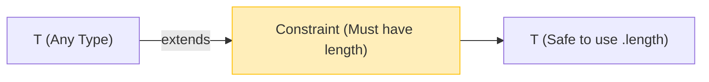

## 🚀 អ្វីទៅជា Generics? (រំលឹកឡើងវិញ)

**Generics** (តំណាងដោយអក្សរ `<T>`) គឺប្រៀបដូចជា **"អថេរសម្រាប់ទុក Type"** អញ្ចឹង។ 
វាអនុញ្ញាតអោយយើងសរសេរ Function ឬកូដម្តង តែអាចប្រើបានជាមួយប្រភេទទិន្នន័យច្រើនមុខ។



```ts
// T អាចជា string, number ឫប្រភេទអ្វីក៏បាន អាស្រ័យលើពេលគេហៅវា
function identity<T>(value: T): T {
  return value;
}

const a = identity<string>("Hello"); // T គឺជា string
const b = identity<number>(100);     // T គឺជា number
```

---

## 1. Generic Constraints (ការដាក់លក្ខខណ្ឌ)

បញ្ហារបស់ Generic ធម្មតាគឺវា **"សេរីពេក"**! `T` អាចជាអ្វីក៏បាន។ ចុះបើ Function របស់អ្នកត្រូវការអានប្រវែង (`.length`) របស់ទិន្នន័យនោះ? បើគេបញ្ជូន `number` មក វានឹង Crash ព្រោះលេខអត់មាន `.length` ទេ!

ដើម្បីដោះស្រាយបញ្ហានេះ យើងត្រូវដាក់លក្ខខណ្ឌ (Constraint) ទៅលើ `T` ដោយប្រើពាក្យ **`extends`**។

```ts
// ប្រាប់ថា T ត្រូវតែមានរូបរាងជាអ្វីក៏ដោយ អោយតែមាន property 'length'
function printLength<T extends { length: number }>(item: T) {
  console.log("ប្រវែងគឺ:", item.length);
}

// ✅ ត្រូវ! ព្រោះ Array មាន `.length`
printLength([1, 2, 3]); 

// ✅ ត្រូវ! ព្រោះ String មាន `.length`
printLength("សួស្តី"); 

// ❌ Error! ព្រោះលេខអត់មាន `.length` ទេ! (សុវត្ថិភាពខ្ពស់ណាស់!)
// printLength(100); 
```

---

## 2. Generic Defaults (តម្លៃលំនាំដើម)

ដូចគ្នានឹង Function Parameters ដែរ យើងអាចអោយតម្លៃ Default ទៅកាន់ Generic Type ក្នុងករណីដែលគេមិនបានប្រាប់ថា `T` ជាអ្វី!

```ts
// បើគេមិនបញ្ជាក់ T ទេ, យើងនឹងចាត់ទុក T ថាជា 'string'
type APIResponse<T = string> = {
  status: number;
  data: T;
};

// មិនបាច់ប្រាប់ T ក៏បាន (វាយក string ជា default)
const textRes: APIResponse = {
  status: 200,
  data: "ជោគជ័យ!" // ត្រូវតែជាអក្សរ
};

// បើចង់បាន Object យើងត្រូវប្រាប់វា
const objRes: APIResponse<{ id: number }> = {
  status: 200,
  data: { id: 1 }
};
```

ការប្រើ Generic Default ពិតជាមានប្រយោជន៍ខ្លាំងណាស់ក្នុងការសរសេរ Type សម្រាប់បណ្ណាល័យ (Libraries) ដែលផ្តល់ភាពងាយស្រួលដល់អ្នកប្រើប្រាស់!
