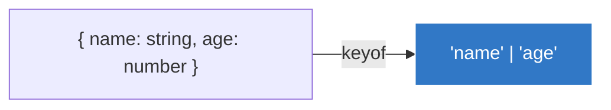

## 🔑 1. `keyof` (អ្នកទាញយក Keys)

`keyof` គឺជាឧបករណ៍សម្រាប់ទាញយក **ឈ្មោះ Property ទាំងអស់ (Keys)** ចេញពី Type (Object) មួយ រួចបង្កើតវាទៅជា Union Type នៃអក្សរ (String Literals)។



```ts
type User = {
  name: string;
  age: number;
  email: string;
};

// ទាញយក Keys ទាំងអស់ពី User
type UserKeys = keyof User; 
// លទ្ធផល: "name" | "age" | "email"

// ឥឡូវអ្នកអាចប្រើវាដើម្បីកំណត់លក្ខខណ្ឌបាន!
let prop: UserKeys = "age"; // ✅ ត្រូវ
// let prop2: UserKeys = "phone"; // ❌ ខុស! ព្រោះ User អត់មាន phone ទេ
```

---

## 🖨️ 2. `typeof` (អ្នកក្លូន Type)

`typeof` គឺប្រើសម្រាប់ **ទាញយក Type ចេញពី អថេរ (Value)** ដែលមានស្រាប់។ នេះគឺមានប្រយោជន៍ណាស់ពេលអ្នកខ្ជិលសរសេរ Type ដោយខ្លួនឯង!

```ts
// នេះជាអថេរ JavaScript ធម្មតា
const myConfig = {
  theme: "dark",
  fontSize: 14,
  showSidebar: true
};

// ប្រើ typeof ដើម្បីក្លូនយករូបរាងរបស់វា មកធ្វើជា Type!
type ConfigType = typeof myConfig;
/*
  លទ្ធផលដែលទទួលបាន:
  {
    theme: string;
    fontSize: number;
    showSidebar: boolean;
  }
*/
```

> 💡 **គន្លឹះ:** អ្នកសរសេរកម្មវិធីជើងចាស់តែងតែប្រើ `keyof typeof ...` ផ្គួបគ្នា ដើម្បីទាញយកឈ្មោះ Properties ចេញពីអថេរ Object ដោយផ្ទាល់!
> `type ConfigKeys = keyof typeof myConfig; // "theme" | "fontSize" | "showSidebar"`

---

## 🔍 3. Indexed Access Types (ការទាញយក Type តូចៗចេញពី Type ធំ)

នៅក្នុង JavaScript បើអ្នកមាន Object មួយ អ្នកអាចទាញយកតម្លៃរបស់វាតាមរយៈ `object["property"]` មែនទេ?
ចំណែកឯនៅក្នុង TypeScript បើអ្នកមាន Type ធំមួយ អ្នកក៏អាច **"លូកដៃ"** ចូលទៅទាញយក Type តូចៗពីក្នុងនោះមកប្រើបានដែរ ដោយប្រើសញ្ញាដង្កៀប `[]`។

### ការទាញយក Type ពីក្នុង Object

```ts
type Person = {
  age: number;
  name: string;
  alive: boolean;
};

// យក Type ចេញពី age របស់ Person (លទ្ធផល: number)
type Age = Person["age"]; 

let myAge: Age = 25; // ត្រឹមត្រូវ!
```
**ហេតុអ្វីត្រូវធ្វើបែបនេះ?** ព្រោះបើថ្ងៃក្រោយ គេប្តូរ `age: number` ទៅជា `age: string` (ឧ. អាយុ "២៥ឆ្នាំ") នោះអថេរ `Age` របស់អ្នកនឹងផ្លាស់ប្តូរទៅជា `string` តាមដោយស្វ័យប្រវត្តិ!

### ការទាញយកប្រភេទច្រើនព្រមៗគ្នា

អ្នកអាចទាញយកច្រើនជាងមួយដោយប្រើសញ្ញា `|` (Union) នៅខាងក្នុងដង្កៀប!

```ts
// លទ្ធផល: number | string
type AgeOrName = Person["age" | "name"]; 

// ឫអ្នកអាចប្រើ keyof តែម្តង ដើម្បីទាញយក Types ទាំងអស់មកឡូកឡំគ្នា!
type AllTypes = Person[keyof Person]; 
// លទ្ធផល: number | string | boolean
```

### ការទាញយក Type ចេញពី Array

ប្រសិនបើទិន្នន័យរបស់អ្នកជាទម្រង់បញ្ជី (Array) នោះអ្នកអាចប្រើ **`[number]`** ដើម្បីទាញយកប្រភេទរបស់សមាជិកដែលនៅក្នុងនោះ!

```ts
// នេះជា Array ដែលផ្ទុក Object ច្រើន
const MyArray = [
  { name: "Alice", age: 15 },
  { name: "Bob", age: 23 },
  { name: "Eve", age: 38 },
];

// ចុះបើយើងចង់ទាញយក Type របស់មនុស្សម្នាក់ៗ (Object) ចេញពី Array នោះ?
type PersonInsideArray = typeof MyArray[number];
/* 
  លទ្ធផលដែលទទួលបាន:
  {
    name: string;
    age: number;
  }
*/
```
