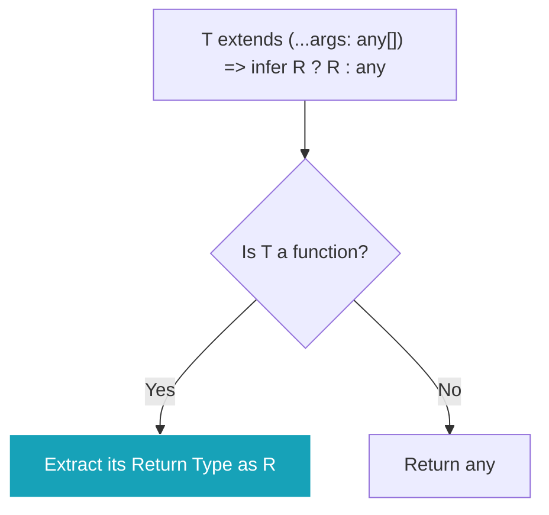

## 🕵️‍♂️ `infer` (អ្នកស៊ើបអង្កេត)

`infer` គឺជាពាក្យដែលពិបាកយល់ជាងគេបន្តិចនៅក្នុង TypeScript។ វាត្រូវបានគេប្រើតែនៅក្នុង **Conditional Types (`extends ? :`)** ប៉ុណ្ណោះ។ 

`infer` មានតួនាទីជាអ្នកស៊ើបអង្កេត ដើម្បីលូកដៃចូលទៅចាប់ទាញយក (Extract) Type ណាមួយចេញពីក្នុងរចនាសម្ព័ន្ធដ៏ស្មុគស្មាញ រួចរក្សាទុកក្នុងអថេរមួយដើម្បីអោយយើងអាចយកវាទៅប្រើបន្ត។



ឧទាហរណ៍៖ ទាញយកប្រភេទ (Return Type) ចេញពី Function

```ts
// យើងបង្កើត Conditional Type មួយ សម្រាប់ឆែកមើលថា T ជា Function ឫអត់?
// បើវាជា Function, សូមស៊ើបអង្កេត (infer) មើលថាវានឹង return លទ្ធផលអ្វី (R) រួចប្រគល់ R នោះមកវិញ!
// បើមិនមែនជា Function ទេ ប្រគល់ any មកវិញ។
type GetReturnType<T> = T extends (...args: any[]) => infer R ? R : any;


// សាកល្បងប្រើ
function doMath() {
  return 100; // លទ្ធផលជាលេខ (number)
}

// ទាញយក Return Type របស់មុខងារ doMath
type MathResult = GetReturnType<typeof doMath>;
// លទ្ធផល: number
```

*(កំណត់សម្គាល់: TypeScript មាន `ReturnType<T>` ស្រាប់សម្រាប់ធ្វើការងារខាងលើនេះ នេះគ្រាន់តែជាការពន្យល់ពីរបៀបដែល `infer` ដំណើរការនៅពីក្រោយខ្នងប៉ុណ្ណោះ)*

### ការទាញយក Type ចេញពី Array ជាមួយ `infer`

អ្នកក៏អាចប្រើ `infer` ដើម្បីទាញយក Type របស់សមាជិក (Elements) ដែលរស់នៅក្នុង Array ផងដែរ។

```ts
// បើ T ជា Array, ស៊ើបអង្កេតថាតើសមាជិករបស់វាជាអ្វី (U), រួចប្រគល់ U មកវិញ
type FlattenArray<T> = T extends Array<infer U> ? U : T;

type MyStringArray = Array<string>;
type ExtractedType = FlattenArray<MyStringArray>; // លទ្ធផល: string

type NotAnArray = number;
type ExtractedType2 = FlattenArray<NotAnArray>; // លទ្ធផល: number (ព្រោះវាមិនមែនជា Array)
```
