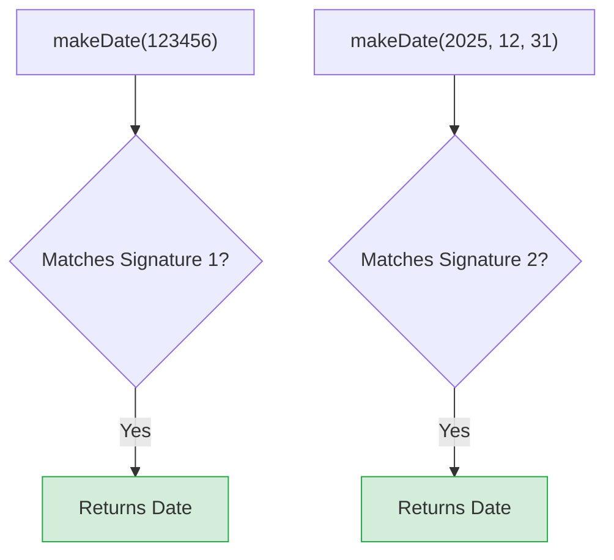

## 🤹‍♂️ អ្វីទៅជា Function Overloading?



ជាញឹកញាប់ អ្នកប្រហែលជាចង់សរសេរ Function មួយដែលអាចធ្វើការងារច្រើនរបៀប។ 
ឧទាហរណ៍៖ Function `makeDate` ដែលអាចទទួលយក **វិនាទី (Timestamp ជាលេខ)** ឬ **ថ្ងៃខែឆ្នាំ (Day, Month, Year ជាលេខ ៣)**។

ប្រសិនបើយើងប្រើ Union Types ធម្មតា៖
```ts
function makeDate(timestampOrYear: number, month?: number, day?: number) {
  // ... កូដនៅទីនេះ ...
}
```
បញ្ហាគឺ TypeScript នឹងអនុញ្ញាតអោយគេបញ្ជូនលេខ **២ ខ្ទង់** ក៏បាន! (ឧ. `makeDate(2025, 12)` ដែលនេះជារឿងខុសឆ្គង ព្រោះបើដាក់ថ្ងៃខែឆ្នាំ ត្រូវតែមាន ៣ ខ្ទង់ពេញ)។

ដើម្បីដោះស្រាយបញ្ហានេះ យើងត្រូវប្រើ **Function Overloading**!

---

## របៀបសរសេរ Function Overloading

ការធ្វើ Overloading គឺមាន ២ ផ្នែកសំខាន់ៗ៖ 
1. **Overload Signatures:** ការប្រកាសប្រាប់រាល់ "រូបរាង" ឫ "របៀប" ទាំងអស់ដែល Function នោះអាចទទួលយកបាន (សរសេរតែឈ្មោះ គ្មានតួខ្លួនកូដទេ)។
2. **Implementation:** ការសរសេរកូដពិតប្រាកដនៅខាងក្រោមគេបង្អស់ ដែលត្រូវតែគ្របដណ្តប់គ្រប់ស្ថានភាពទាំងអស់ខាងលើ។

```ts
// 1. Overload Signatures (ប្រកាសប្រាប់ថាមាន 2 របៀបក្នុងការហៅវា)

// របៀបទី 1: បញ្ជូនលេខតែមួយគត់ (Timestamp)
function makeDate(timestamp: number): Date; 

// របៀបទី 2: បញ្ជូនលេខ 3 (ឆ្នាំ, ខែ, ថ្ងៃ)
function makeDate(year: number, month: number, day: number): Date; 


// 2. Implementation (កូដពិតប្រាកដដែលត្រូវសរសេរអោយគ្របដណ្តប់របៀបទាំង 2)
// ចំណាំ: កូដនេះអ្នកប្រើប្រាស់មិនអាចមើលឃើញ (ហៅផ្ទាល់) បានទេ
function makeDate(mOrTimestamp: number, d?: number, y?: number): Date {
  if (d !== undefined && y !== undefined) {
    // ចូលករណីទី 2 (មាន 3 លេខ)
    return new Date(y, mOrTimestamp, d);
  } else {
    // ចូលករណីទី 1 (មានតែ 1 លេខ)
    return new Date(mOrTimestamp);
  }
}
```

ឥឡូវនេះសាកល្បងហៅវាប្រើមើល៖

```ts
// ✅ ត្រឹមត្រូវ! (ចូលរបៀបទី 1)
const d1 = makeDate(12345678); 

// ✅ ត្រឹមត្រូវ! (ចូលរបៀបទី 2)
const d2 = makeDate(5, 5, 5); 

// ❌ Error! ព្រោះយើងមិនបានប្រកាស Overload ដែលទទួលលេខ 2 ខ្ទង់ទេ! 
// const d3 = makeDate(1, 3); 
```

នេះគឺជាវិធីដ៏ល្អបំផុតក្នុងការគ្រប់គ្រងអោយច្បាស់លាស់ថា តើអ្នកប្រើប្រាស់អាចបញ្ជូនអ្វីខ្លះមកកាន់ Function របស់អ្នក!

---

## ⚖️ Union Types vs Function Overloading

ពេលខ្លះអ្នកអាចនឹងឆ្ងល់ថា តើពេលណាគួរប្រើ Union Types ហើយពេលណាគួរប្រើ Overloading?

- **ប្រើ Union Types:** ពេលដែល Logic របស់កូដគឺដូចគ្នាទាំងស្រុង ទោះបីជាអ្នកបញ្ជូនអ្វីចូលក៏ដោយ។ ឧទាហរណ៍៖ `printMessage(msg: string | number)`។
- **ប្រើ Function Overloading:** ពេលដែល ចំនួន Parameter ខុសគ្នា ឬ Return Type ប្រែប្រួលទៅតាម Parameter ដែលបញ្ជូនចូល។ ឧទាហរណ៍៖ `makeDate` ខាងលើ ដែលទាមទារ Parameter ចំនួន ១ ឫ ចំនួន ៣។ វាជួយការពារកុំអោយអ្នកប្រើប្រាស់បញ្ជូន Parameter ចំនួន ២ ដែលជាការខុសឆ្គង។
