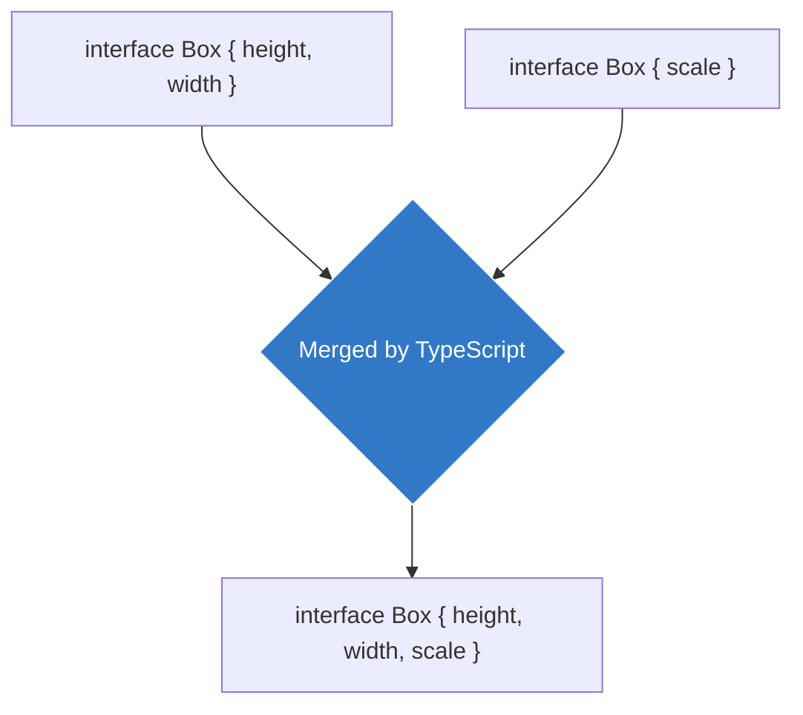

## 🤝 អ្វីទៅជា Declaration Merging?



**Declaration Merging** គឺជាសមត្ថភាពរបស់កម្មវិធីបកប្រែ (Compiler) របស់ TypeScript ក្នុងការយកការប្រកាស (Declarations) ពីរឫច្រើនដែលមាន **"ឈ្មោះដូចគ្នា"** មកបូកបញ្ចូលគ្នាអោយក្លាយទៅជាការប្រកាសតែមួយ (មានន័យថាវាបូកបញ្ជូល Properties ទាំងអស់ចូលគ្នា)។

ក្បួននេះភាគច្រើនកើតឡើងទៅលើ **`interface`** (មិនអាចប្រើជាមួយ `type` បានទេ)!

### ឧទាហរណ៍ជាក់ស្តែង៖

```ts
// ទី ១: យើងប្រកាស Interface ដំបូង
interface Box {
  height: number;
  width: number;
}

// ទី ២: នៅកន្លែងផ្សេង យើងប្រកាសឈ្មោះដដែលនេះម្តងទៀត!
interface Box {
  scale: number;
}

// តើលទ្ធផលទៅជាយ៉ាងណា?
// TypeScript នឹងបូកវាចូលគ្នាដោយស្វ័យប្រវត្តិ!
let myBox: Box = {
  height: 10,
  width: 10,
  scale: 2  // ត្រូវតែមាន ព្រោះវាបាន Merge ចូលគ្នាហើយ
};
```

---

## 🤷‍♂️ ហេតុអ្វីបានជាមុខងារនេះមានប្រយោជន៍?

អ្នកប្រហែលជាគិតថា៖ *"ហេតុអ្វីមិនសរសេរវាបញ្ចូលគ្នាតាំងពីដំបូងទៅ ចាំបាច់សរសេរពីរដងធ្វើអី?"*។

ចម្លើយគឺ៖ សម្រាប់ការសរសេរកូដធម្មតារបស់អ្នក ការសរសេរអោយចប់តាំងពីដំបូងគឺជារឿងត្រឹមត្រូវ។ ប៉ុន្តែ **Declaration Merging មានប្រយោជន៍បំផុតនៅពេលអ្នកចង់ "បន្ថែម" (Extend) លក្ខណៈសម្បត្តិទៅអោយបណ្ណាល័យ (Third-party Libraries) របស់អ្នកដទៃ!**

ឧទាហរណ៍: អ្នកដំឡើង Express.js មកប្រើ ហើយអ្នកចង់បន្ថែមពត៌មាន `user` ចូលទៅក្នុងអថេរ `Request` របស់ Express (ដែលដើមឡើយវាគ្មាន `user` ទេ)។

```ts
// យើងប្រកាស Interface ឈ្មោះដូចគ្នានឹងរបស់ Express ដើម្បី Merge របស់ថ្មីចូល
declare namespace Express {
  export interface Request {
    user?: {
      id: string;
      role: string;
    }
  }
}

// ឥឡូវនេះរាល់ពេលអ្នកហៅ req វាមាន req.user ប្រើហើយ!
```
នេះហើយជាមូលហេតុដែលអ្នកអភិវឌ្ឍន៍បណ្ណាល័យធំៗ (Libraries) តែងតែប្រើប្រាស់ `interface` ជំនួសអោយ `type` ដើម្បីបើកផ្លូវអោយអ្នកដទៃអាចងាយស្រួលបន្ថែមរបស់ថ្មីៗចូលទៅក្នុងកូដរបស់ពួកគេបាន!
